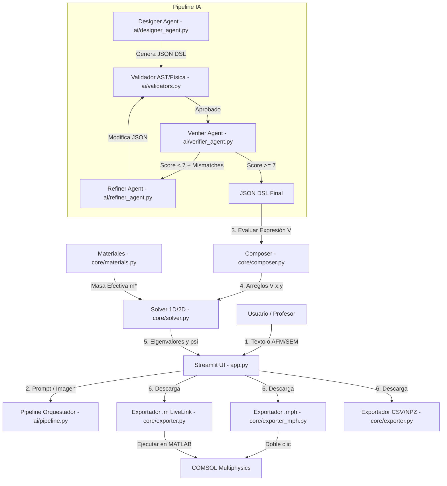

# ⚛️ Guía de Presentación Académica: Quantum Potential AI
> **Creado por:** Antigravity (IA) para Juan José  
> **Fecha:** Junio 2026  
> **Propósito:** Estructura completa de explicación para la reunión de avance con el profesor.

Este documento organiza toda la estructura de la aplicación, el motor científico, el pipeline de Inteligencia Artificial y la integración con COMSOL para que puedas explicárselo a tu profesor de manera clara, rigurosa y ordenada.

---

## 🗺️ 1. Estructura General del Proyecto (Arquitectura de Software)

El proyecto está diseñado bajo una arquitectura modular y desacoplada en tres capas principales:

1. **Capa del Núcleo Científico (`core/`)**: Independiente de la interfaz gráfica y de la IA. Contiene las definiciones físicas de materiales, solvers numéricos, primitivas geométricas del DSL y exportadores.
2. **Capa de Inteligencia Artificial (`ai/`)**: Orquesta el pipeline multi-agente para traducir lenguaje natural e imágenes AFM en diseños estructurados y verificar su fidelidad de forma iterativa.
3. **Capa de Interfaz de Usuario (`app.py`)**: Construida en Streamlit. Proporciona una interfaz web reactiva, visualizaciones interactivas de potenciales y funciones de onda, controles manuales (sliders) y el recetario interactivo paso a paso para COMSOL.

### Diagrama de Flujo de Datos y Componentes



---

## 🧮 2. Fundamentos Científicos (Lo que le interesa al Profesor)

Para presentarte con autoridad académica, debes dominar los tres pilares científicos del proyecto:

### A. La Ecuación de Schrödinger de Masa Efectiva
El sistema modela el confinamiento de **un solo electrón** en heteroestructuras semiconductoras de baja dimensión (puntos cuánticos, pozos de potencial, anillos cuánticos). El Hamiltoniano estacionario de una sola partícula es:

$$H \psi(\mathbf{r}) = E \psi(\mathbf{r})$$

$$H = -\frac{\hbar^2}{2} \nabla \cdot \left( \frac{1}{m^*(\mathbf{r})} \nabla \right) + V(\mathbf{r})$$

Donde:
* $m^*(\mathbf{r}) = m_{eff}(\mathbf{r}) \cdot m_0$ es la **masa efectiva del electrón** en la banda de conducción del semiconductor (por ejemplo, para GaAs, $m_{eff} = 0.067$). *Nota: Por simplicidad computacional en esta primera fase, la masa efectiva se considera homogénea en el dominio según el material del canal.*
* $V(\mathbf{r})$ es el perfil del potencial electrostático en el espacio, determinado por:
  1. Las barreras de alineación de banda de energía (ej. interfaces GaAs/AlGaAs).
  2. Impurezas donadoras/aceptadoras (potencial de Coulomb regularizado).
  3. Campos eléctricos externos aplicados (efecto Stark lineal, $V_{field} = q \mathbf{F} \cdot \mathbf{r}$).

### B. El Solver Numérico de Diferencias Finitas (FD)
Para resolver la ecuación diferencial parcial de autovalores sin simplificaciones analíticas, aproximamos el operador Laplaciano utilizando el método de diferencias finitas en una malla regular.

* **Aproximación en 1D (Esquema de 3 Puntos)**:
  $$\frac{d^2 \psi}{dx^2} \approx \frac{\psi_{i+1} - 2\psi_i + \psi_{i-1}}{\Delta x^2}$$
  Esto transforma el Hamiltoniano en una **matriz tridiagonal** simétrica de dimensión $N_x \times N_x$. Se diagonaliza rápidamente usando `scipy.linalg.eigh_tridiagonal`.

* **Aproximación en 2D (Esquema de 5 Puntos / Stencil de 5 Puntos)**:
  $$\nabla^2 \psi \approx \frac{\psi_{i+1, j} + \psi_{i-1, j} - 4\psi_{i,j} + \psi_{i, j+1} + \psi_{i, j-1}}{\Delta h^2}$$
  Donde $\Delta h = \Delta x = \Delta y$. Para un dominio de malla $N_x \times N_y$, la matriz Hamiltoniana resultante tiene un tamaño gigante de $(N_x N_y) \times (N_x N_y)$, pero es **extremadamente dispersa (sparse)**.
  Usamos el **algoritmo de Arnoldi** de iteración de subespacios (`scipy.sparse.linalg.eigs` en modo shift-invert) para extraer únicamente los $N$ niveles ligados de menor energía ($E_n < 0$) y sus funciones de onda $\psi_n(x,y)$, evitando calcular los infinitos estados del continuo.

### C. El Compositor de Potenciales (JSON DSL)
El puente entre la IA y las matemáticas es nuestro **DSL (Domain-Specific Language)** basado en JSON. En lugar de representar el potencial como una grilla fija de pixeles (lo cual introduciría ruido numérico y perdería control de parámetros), lo modelamos como una **suma aditiva de primitivas físicas paramétricas**.

```json
{
  "dim": 2,
  "material": "GaAs",
  "domain": {"L": 200.0, "N": 128},
  "pieces": [
    {
      "label": "Pozo principal",
      "op": "mexican_hat",
      "args": {"center": [0.0, 0.0], "r0": 40.0, "depth": 0.236}
    }
  ]
}
```

Cada pieza geométrica se define de forma analítica en [core/primitives.py](file:///c:/Users/JUAN_JOSE/Documents/Proyecto_cuantica/core/primitives.py):
* **Regiones**: `disk`, `annulus`, `rectangle` (rotado), `ellipse`, `super_ellipse`, `rose`, `polygon`.
* **Perfiles**: `constant`, `gaussian`, `mexican_hat` (sombrero mexicano para anillos), `coulomb` (regularizado como $V = -e^2 / (4\pi \varepsilon_0 \varepsilon_r \sqrt{r^2 + a_{reg}^2})$), `linear` (efecto Stark), `polynomial`.

---

## 🤖 3. El Flujo de Inteligencia Artificial (Robustez y Seguridad)

Es crucial explicarle al profesor que **no confiamos ciegamente en la IA**. Hemos construido un sistema con redundancias, verificación científica y sandbox de seguridad:

1. **Cadena de Pensamiento (CoT)**: La IA (Claude) no devuelve código directamente. Primero analiza físicamente el problema (`<analysis>`), propone el diseño (`<design>`) y realiza una auto-crítica de límites físicos (`<self_critique>`).
2. **Ciclo Cerrado de Verificación Visual (Verifier + Refiner)**:
   * El **Verifier** es un agente multimodal que compara visualmente el render del potencial generado con la imagen AFM de entrada. Califica de 0 a 10.
   * Si el puntaje es menor a 7, el **Refiner** corrige los errores específicos basándose en el feedback visual. Esto ocurre de forma autónoma hasta un máximo de 3 iteraciones antes de mostrar los resultados.
3. **Sandbox AST para Expresiones Libres (`raw_expr`)**: Si el usuario o la IA ingresan una expresión matemática personalizada mediante `raw_expr`, esta no se evalúa con `eval()` o `exec()` directos. Se analiza su Árbol de Sintaxis Abstracta (AST) contra una lista blanca estricta (solo funciones numpy y variables espaciales), garantizando la seguridad del servidor.
4. **Puerta de Validación COMSOL (`harnex`)**: Antes de llamar a COMSOL para la generación del archivo `.mph`, el código valida los rangos físicos (tamaño del dominio, masa efectiva, discretización de grilla) para asegurar que COMSOL nunca falle por parámetros inconsistentes.

---

## 🔬 4. Plan de Validación (Pruebas de que el Solver Funciona)

El profesor preguntará: *¿Cómo sé que el solver numérico de Python da resultados correctos?*
La respuesta está en la comparación directa con **soluciones analíticas exactas**:

### Caso 1: Pozo Infinito 1D ( GaAs, Ancho $L_w = 40\text{ nm}$ )
La fórmula analítica para las energías permitidas es:
$$E_n = \frac{n^2 \pi^2 \hbar^2}{2 m^* L_w^2}$$

Para el estado fundamental ($n=1$) en GaAs ($m_{eff} = 0.067$):
* **Valor analítico**: $3.508\text{ meV}$
* **Valor numérico de la app (N=512)**: $3.475\text{ meV}$
* **Error**: **$0.9\%$** (se reduce a $<0.1\%$ si aumentamos la discretización).

### Caso 2: Oscilador Armónico Parabólico 1D ($\omega = 0.0005\text{ u.a.}$)
Las energías permitidas son equiespaciadas:
$$E_n = \left(n + \frac{1}{2}\right) \hbar \omega$$

* **Diferencia entre niveles (Analítico)**: $11.923\text{ meV}$
* **Diferencia entre niveles (Numérico)**: $11.923\text{ meV}$
* **Error**: **$< 0.01\%$**

> [!NOTE]
> La aplicación incluye una pestaña interactiva de **"Validación con solución analítica"** donde el profesor puede ver estas comparaciones en vivo y graficar el error numérico en función del tamaño de la grilla.

---

## 💻 5. Integración con COMSOL (El puente con la industria)

El proyecto ofrece tres caminos complementarios para conectar con COMSOL Multiphysics:

| Método | Cómo funciona | Ventajas |
| :--- | :--- | :--- |
| **1. Archivo Nativo `.mph`** | Generado desde Python usando la API Java de COMSOL a través de la librería `MPh`. Crea geometría, malla, física de PDE y estudio de eigenvalores. | Listo para abrir con doble clic en COMSOL. Configura automáticamente límites de visualización (`plotargs`) a escala nanométrica. |
| **2. Script LiveLink `.m`** | Script de MATLAB autogenerado que controla la API de COMSOL. | Funciona en cualquier computador con MATLAB y LiveLink sin necesidad de configurar Java en Python. |
| **3. Receta Paso a Paso (UI)** | Un panel dinámico en Streamlit que explica de forma humana cómo construir el modelo manualmente en la interfaz gráfica de COMSOL. | Excelente para fines docentes; el estudiante aprende qué significa cada nodo de COMSOL. |

---

## 🎤 6. Guion Recomendado para la Reunión con el Profesor

Sigue este orden para estructurar tu presentación de 15 minutos:

### Paso 1: Introducción y Motivación (2 mins)
* *"El objetivo del proyecto es acelerar el diseño de dispositivos cuánticos y heteroestructuras. Tradicionalmente, montar un modelo en COMSOL toma mucho tiempo de geometría y parametrización. Hemos creado una herramienta que automatiza esto partiendo de una descripción física o una imagen experimental (AFM)."*

### Paso 2: Mostrar la Interfaz y el Catálogo (3 mins)
* Abre la Streamlit en vivo (ejecutando `python -m streamlit run app.py`).
* Muestra el **Modo 1D Catálogo** y **2D Catálogo**.
* *"Aquí tenemos los modelos clásicos con sliders para ajustar el ancho, profundidad de pozos, o radio de anillos. Sirve como laboratorio virtual rápido."*
* Resuelve el solver en vivo y muestra cómo se grafican los niveles de energía acoplados al potencial y las funciones de onda.

### Paso 3: Demostración del "Designer" por IA (4 mins)
* Cambia al modo **2D Designer (IA)**.
* Escribe la descripción del pozo doble que configuramos:  
  > *"Dos pozos cuánticos estándar separados por una distancia b de 10 nm, cada uno con un radio a de 25 nm y una profundidad de 236 meV, en un canal de GaAs."*
* Haz clic en **Lanzar pipeline IA**.
* Muestra cómo la IA descompone la descripción en el JSON DSL analítico y cómo corre el pipeline de validación.
* Muestra el gráfico del potencial resultante y las funciones de onda resueltas.

### Paso 4: Exportación e Integración con COMSOL (3 mins)
* Muestra el botón **"Generar .mph"** y **"Generar .m"**.
* Explica la **Receta de Construcción Paso a Paso** que aparece en el expander de la UI.
* *"Si queremos continuar el análisis en COMSOL (por ejemplo, para estudios de transporte, acoplamiento de fotones o deformaciones elásticas avanzadas), la app nos genera un archivo nativo `.mph` con toda la física (Coefficient Form PDE) parametrizada. No hay que configurar nada a mano."*

### Paso 5: Conclusiones, Limitaciones y Roadmap (3 mins)
* Sé honesto sobre las limitaciones actuales y el trabajo futuro (ver sección 7). Esto demuestra madurez científica.

---

## 🔮 7. Limitaciones Actuales y Roadmap (Sinceridad Científica)

Presentar las limitaciones del software no es una debilidad, es una **fortaleza académica** porque demuestra rigor científico:

* **Masa Efectiva Homogénea**: Actualmente, el solver de diferencias finitas asume que la masa efectiva $m^*$ es constante en todo el dominio (determinada por el material principal del canal, ej. GaAs). En heteroestructuras reales (como GaAs/AlGaAs), la masa efectiva cambia abruptamente en la interfaz.
  * *Roadmap*: Modificar el operador Laplaciano en el solver para soportar masa efectiva dependiente de la posición: $\nabla \cdot (\frac{1}{m^*(\mathbf{r})} \nabla \psi)$.
* **Sistemas de un solo electrón**: No incluye correlación electrón-electrón (sistemas de muchos cuerpos).
  * *Roadmap*: Implementar un solver auto-consistente de Poisson-Schrödinger para modelar la repulsión de Coulomb entre múltiples electrones en el pozo.
* **Campos Magnéticos Avanzados**: Actualmente no cuenta con un término de gauge de Landau para efecto Zeeman o niveles de Landau directos en el solver local, aunque se pueden ingresar mediante expresiones algebraicas libres en el composer.

---

## ❓ 8. Banco de Respuestas ante Preguntas Difíciles del Profesor

| Pregunta del Profesor | Respuesta Sugerida |
| :--- | :--- |
| **¿Por qué decidieron usar diferencias finitas en lugar de elementos finitos (FEM) como COMSOL?** | *"Para el solver rápido en la aplicación web, las diferencias finitas (FD) en una malla estructurada regular permiten una implementación muy directa de la ecuación de autovalores, traduciéndose en matrices tridiagonales (1D) o pentadiagonales dispersas (2D). Esto se resuelve en menos de un segundo en CPU. Dejamos el método de elementos finitos (FEM) para COMSOL, que es donde se exporta el modelo cuando se requiere precisión geométrica fina o mallas adaptativas en bordes curvos."* |
| **¿Cómo se definen las condiciones de frontera en el solver de la aplicación?** | *"Utilizamos condiciones de frontera de Dirichlet homogéneas ($\psi = 0$) en los bordes del dominio de simulación. Por eso, en la interfaz recomendamos que el tamaño del dominio ($L$) sea al menos 2 o 3 veces más grande que el tamaño del pozo cuántico, de modo que las funciones de onda de los estados ligados decaigan a cero de forma natural antes de tocar el borde, evitando efectos espurios de confinamiento artificial."* |
| **¿Cómo maneja la aplicación el potencial singular de Coulomb de una impureza en 2D sin que diverja a menos infinito?** | *"El potencial puro de Coulomb de una carga puntual de la forma $-1/r$ diverge en el origen ($r=0$), lo que causa inestabilidad en diferencias finitas. Para solucionar esto, implementamos un término de regularización o suavizado (parámetro $a_{reg}$): $V(r) = -e^2 / (4\pi \varepsilon \sqrt{r^2 + a_{reg}^2})$. Físicamente, esto representa el hecho de que la impureza no es una carga matemática puntual pura o simula la extensión espacial de la función de onda del dopante en la dirección z perpendicular al plano."* |
| **¿Cómo se realiza el enlace directo con COMSOL a nivel de código?** | *"A nivel de código, usamos la biblioteca `MPh` en Python, la cual levanta un cliente de Java en segundo plano que se conecta a la API nativa de COMSOL Multiphysics. A través de este cliente Java, creamos la geometría del dominio, definimos las funciones analíticas del potencial, configuramos el nodo físico 'Coefficient Form PDE' y parametrizamos el estudio de autovalores. Todo se compila y se guarda en un archivo binario `.mph` estándar."* |

---

> [!TIP]
> **Recomendación para mañana:** Ten abierto el archivo [GUIA_PROFESOR.md](file:///c:/Users/JUAN_JOSE/Documents/Proyecto_cuantica/GUIA_PROFESOR.md) en tu editor de código o navegador. Si el profesor tiene dudas sobre cómo instalar el software o cómo ingresar los parámetros en COMSOL, puedes mostrarle directamente las secciones correspondientes de ese documento.
