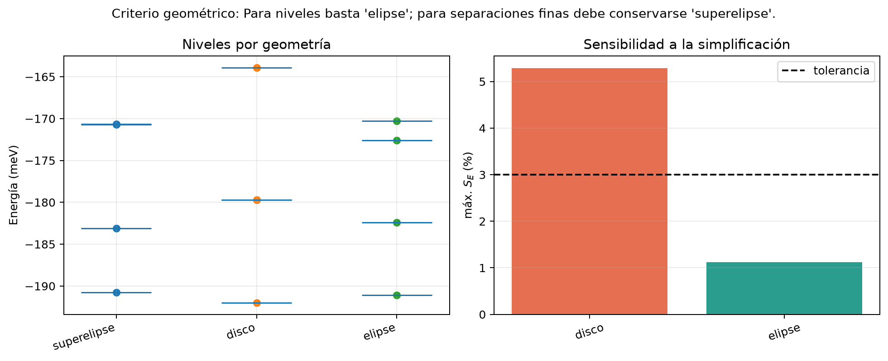

# Estudio de complejidad geométrica

Este caso responde una pregunta distinta de la validación del solver: **¿cuál es la figura
más sencilla que conserva los observables seleccionados?**

La superelipse es la referencia detallada. La elipse y el disco se construyeron con la misma
área teórica, profundidad de 200 meV, material GaAs, dominio y resolución. La elipse conserva
además la relación de aspecto; el disco deliberadamente no lo hace.

```bash
qpot geometry-study \
  --reference examples/geometry_complexity_study/reference_superellipse.json \
  --reference-label superelipse \
  --candidate disco=examples/geometry_complexity_study/candidate_disk.json \
  --candidate elipse=examples/geometry_complexity_study/candidate_ellipse.json \
  --n-states 4 \
  --tolerance-pct 3 \
  --measure-tolerance-pct 5 \
  --aspect-tolerance-pct 10 \
  --gap-tolerance-pct 10 \
  --gap-absolute-tolerance-meV 0.5 \
  --objective levels \
  --out workspace/geometry-study.json
```

El comando no modifica ninguno de los Designs. Produce:

- `geometry-study.json`: energías, separaciones, área, relación de aspecto,
  probabilidades dentro del punto, convergencia y decisión trazable.
- `geometry-study.png`: niveles y sensibilidad máxima
  \(S_E=|E_n^{candidato}-E_n^{referencia}|/|E_n^{referencia}|\times100\%\).

Una simplificación sólo se recomienda si su solver converge, conserva las magnitudes
geométricas controladas y mantiene todos los niveles solicitados dentro de la tolerancia.
El reporte entrega dos conclusiones: una para los niveles individuales y otra para las
separaciones. En este ejemplo la elipse basta para energías, pero la superelipse debe
conservarse si interesan los pequeños *splittings* entre estados casi degenerados.


